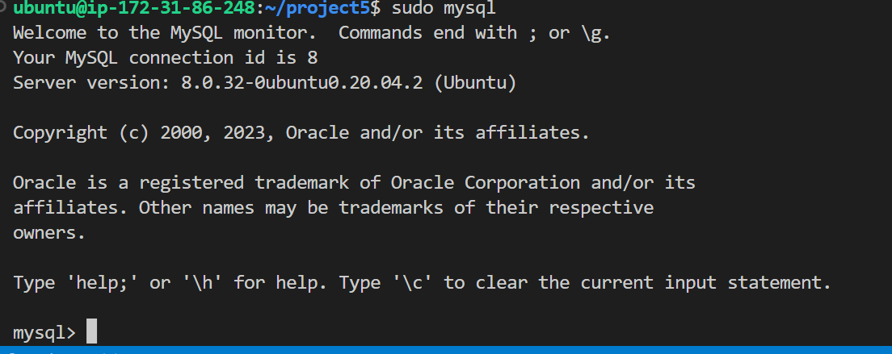
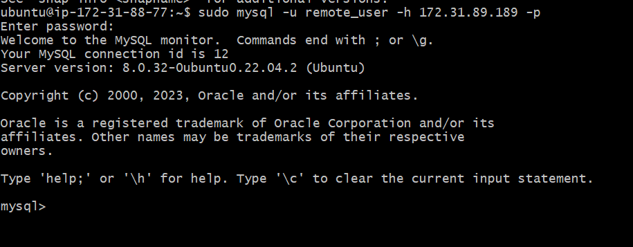
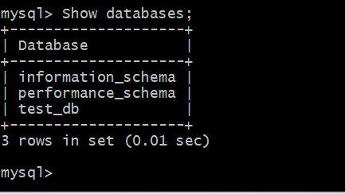

Create and configure two Linux-based virtual servers (EC2 instances in AWS).

Server A name - `mysql server`
Server B name - `mysql client`

Run sudo apt update to update the ubuntu server

On mysql server Linux Server install MySQL Server software using this command 

sudo apt install mysql-server -y

configure mysql by running the following commands

run sudo systemctl enable mysql

sudo mysql 
This will show 

Set a password for the root user, using mysql_native_password as default authentication method
The root user is defined with this passwors 'PassWord.1'

Run the security script that comes pre-installed with MySQL. This script will remove some insecure default settings and lock down access to your database system.

$ sudo mysql_secure_installation

On the mysql-client server run
sudo apt update 
sudo apt install mysql-client -y

Edit the inbound rules in the mysql-server by openning port 3306 and allow access only to the mysql-client server private IP, since they are in the same network

In the mysql-server
create user using this command
CREATE USER 'remote_user'@'%' IDENTIFIED WITH mysql_native_password BY 'password'
create Database test_db with this command

CREATE DATABASE test_db;

Grant access to user to the test_db database
GRANT ALL ON test_db.* TO 'remote_user'@'%' WITH GRANT OPTION;
FLUSH PRIVILEGES:

 Configure MySQL server to allow connections from remote hosts.

sudo vi /etc/mysql/mysql.conf.d/mysqld.cnf
Replace ‘127.0.0.1’ to ‘0.0.0.0’ like this:
 Restart with 
 sudo systemctl restart mysql

 Connect to the server from the client 

 sudo mysql -u remote_user -h 172.31.86.248 -p

 This is the output 

 Check that you have successfully connected to a remote MySQL server and can perform SQL queries:

Show databases;

output 
